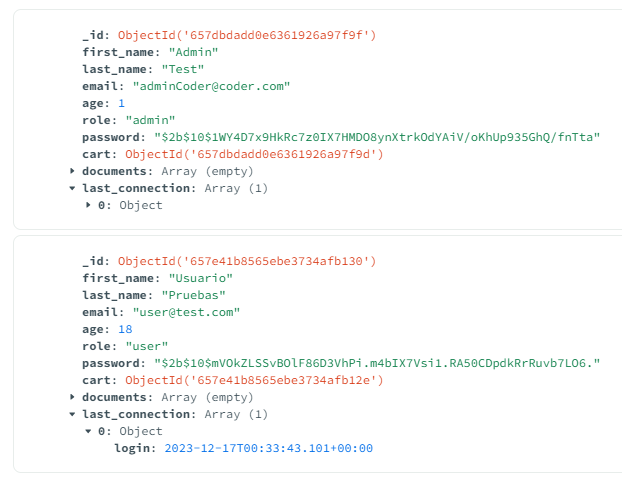
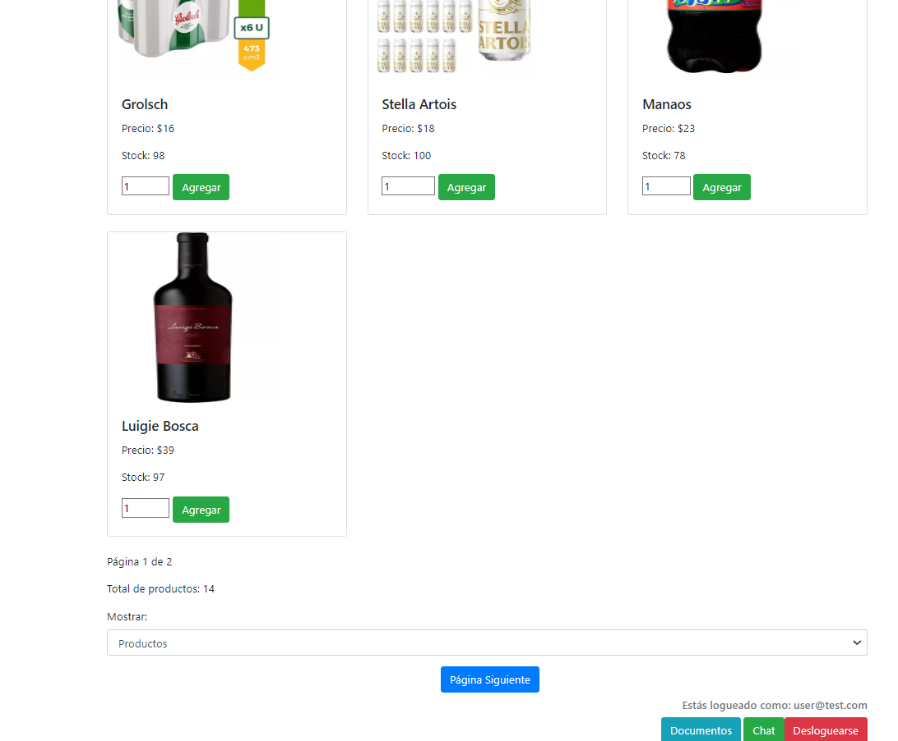
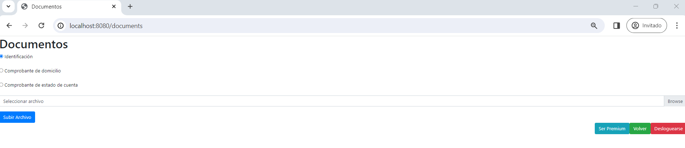

Para poder ver todos los docs correctamente hay que estar logueado previamente en
http://localhost:8080

user: user@test.com
password: 1

DOCS
http://localhost:8080/apidocs/

ADMIN
user: adminCoder@coder.com 
password: 1

Desarrollo carga documentos

