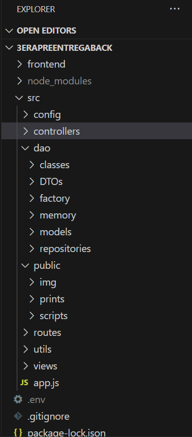
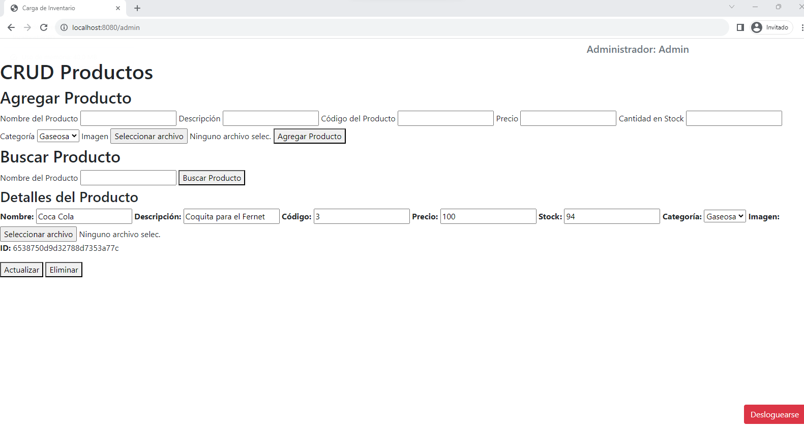
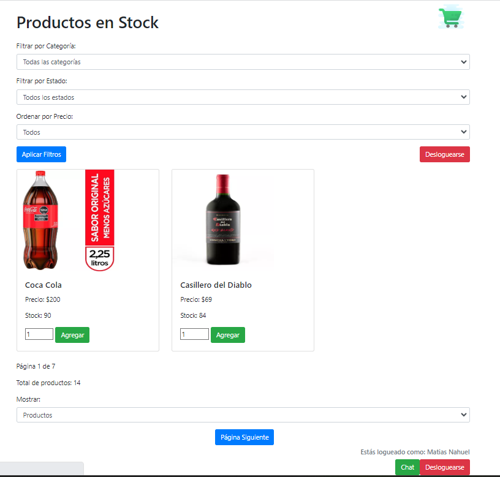
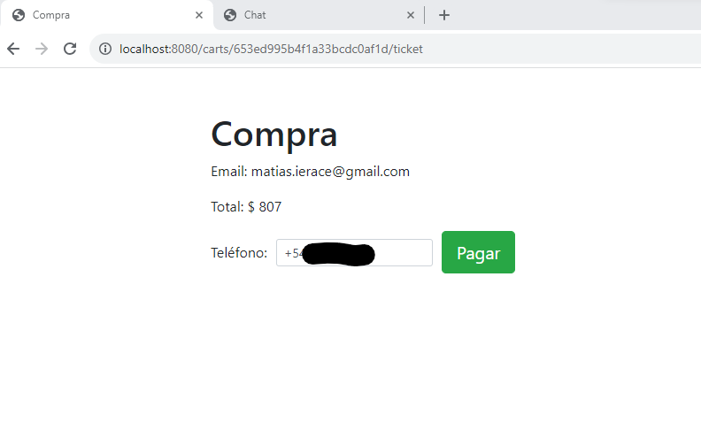

<!--    
        enviar mail usando utils
tengo que implementar:
link del correo debe expirar después de 1 hora de enviado.
Si se trata de restablecer la contraseña con la misma contraseña del usuario, debe impedirlo e indicarle que no se puede colocar la misma contraseña
Si el link expiró, debe redirigir a una vista que le permita generar nuevamente el correo de restablecimiento, el cual contará con una nueva duración de 1 hora.

const jwt = require('jsonwebtoken');
const { secretKey } = require('../config/config'); // Reemplaza con tu propia clave secreta

// Ruta para enviar el correo de restablecimiento de contraseña
app.post('/restore', async (req, res) => {
    const { email } = req.body;

    // Verifica si el correo electrónico existe en tu base de datos
    // ...

    // Genera el token con expiración de 1 hora
    const token = jwt.sign({ email }, secretKey, { expiresIn: '1h' });

    // Incluye el token en el enlace del correo electrónico
    const resetPasswordLink = `https://tudominio.com/reset-password?token=${token}`;

    // Envía el correo electrónico con el enlace de restablecimiento
    try {
        await sendResetPasswordEmail(email, resetPasswordLink);
        res.send("Correo de restablecimiento enviado con éxito");
    } catch (error) {
        console.log(error);
        res.status(500).send("Error al enviar el correo de restablecimiento");
    }
});

// Ruta para restablecer la contraseña
app.get('/reset-password', (req, res) => {
    const { token } = req.query;

    // Verificar y decodificar el token
    jwt.verify(token, secretKey, (err, decoded) => {
        if (err) {
            // Token inválido o expirado
            return res.status(401).send('Token inválido o expirado.');
        }

        // El token es válido, puedes continuar con la página de restablecimiento de contraseña
        const email = decoded.email;
        res.render('reset-password', { email });
    });
});

// Ruta para procesar el restablecimiento de contraseña
app.post('/reset-password', (req, res) => {
    const { email, newPassword } = req.body;

    // Verificar que la nueva contraseña no sea igual a la actual
    // ...

    // Actualizar la contraseña en la base de datos
    // ...

    // Redirigir a la página de inicio de sesión o mostrar un mensaje de éxito
    res.redirect('/login');
});

 -->

ADMIN
user: adminCoder@coder.com 
password: 1

